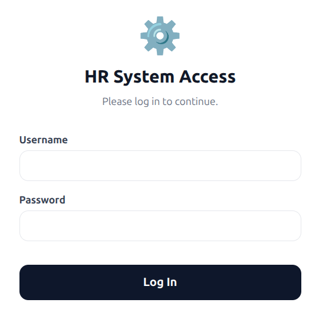
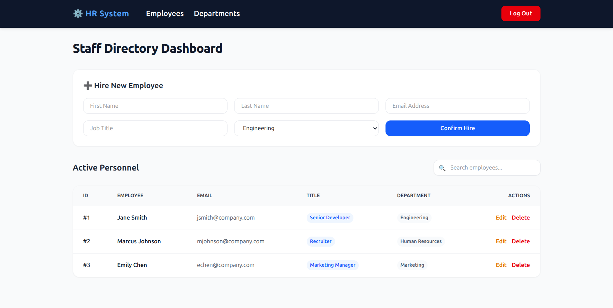
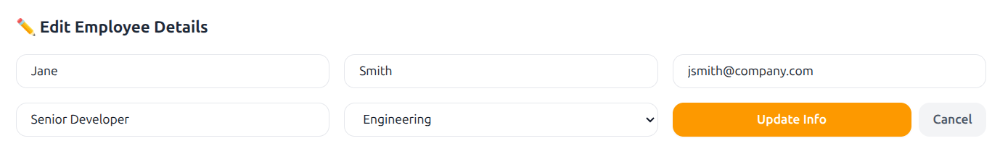
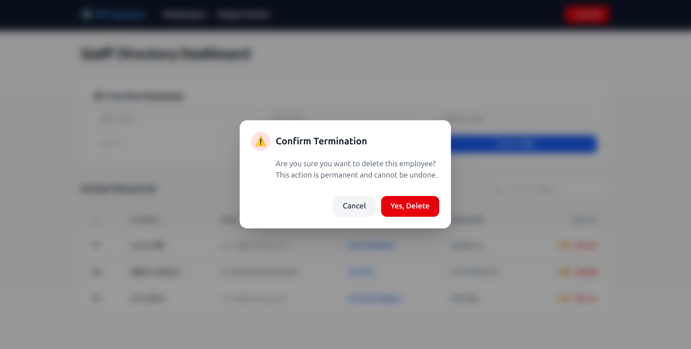
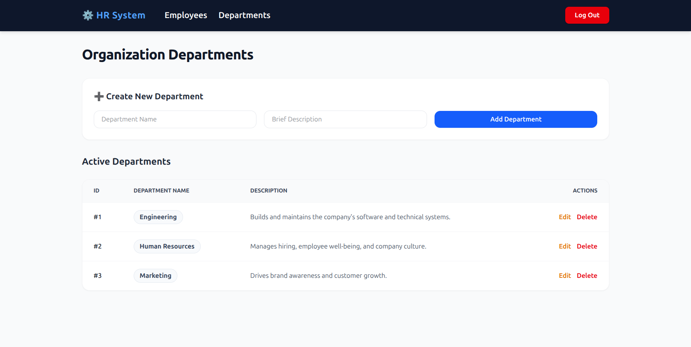

# ⚙️ HR Management System

  
  
  
  
  

A secure, full-stack Human Resources Management application featuring a decoupled React frontend and Spring Boot REST API backend. The system enables organizations to manage company structures by organizing departments and tracking employee information dynamically with database persistence.

  

---

## 🚀 Key Features

* **Role-Based Security:** Controlled dashboard access via authenticated user credentials.
* **Department Management:** Dynamic addition and tracking of corporate divisions.
* **Active Personnel Directory:** Comprehensive tracking of employee records containing full name, email address, job title, and linked department references.
* **Full CRUD Capabilities:** Interactive interface supporting data insertion, reads, inline edits, and deletions with confirmation guards.
* **Database Syncing:** Direct transactional connection to a cloud hosted managed PostgreSQL service.

---

## 🛠️ Technology Stack

| Layer | Technology | Hosting / Platform |
| :--- | :--- | :--- |
| **Frontend** | React (JavaScript / Tailwind CSS) | Vercel |
| **Backend** | Spring Boot (Java / Spring Security) | Render (Dockerized Container) |
| **Database** | PostgreSQL | Neon Cloud Database |

---

## 📊 Sample Dataset Guide

To populate the application environment for demonstration or testing, input the following configuration parameters sequentially (Departments must be instantiated prior to hiring personnel):

### 1. Corporate Departments
| Department Name | Description Summary |
| :--- | :--- |
| **Engineering** | Builds and maintains the company's software and technical systems. |
| **Human Resources** | Manages hiring, employee well-being, and company culture. |
| **Marketing** | Drives brand awareness and customer growth. |

### 2. Active Personnel
| First Name | Last Name | Email Address | Job Title | Linked Department |
| :--- | :--- | :--- | :--- | :--- |
| Jane | Smith | jsmith@company.com | Senior Developer | Engineering |
| Marcus | Johnson | mjohnson@company.com | Recruiter | Human Resources |
| Emily | Chen | echen@company.com | Marketing Manager | Marketing |

---

## 📷 Application Walkthrough

### 1. Secure Authentication Gate
Authorized administrative personnel gain entry using centralized, case-sensitive configuration credentials.

  

---

### 2. Personnel Directory & Operations
The central control panel displays active workforce records with functional utilities for real-time adjustments.

  

---

### 3. Record Modifications & Updates
Inline data modification masks safely process field alterations back to the persistent data store.

  

---

### 4. Safety Guard Rails (Deletion Audits)
Data integrity rules enforce an interactive modal warning checklist before permanently purging a database record.

  

---

### 5. Organizational Structure Setup
Dedicated division panels control the structural layout hierarchy of company components.

  

---

## ⚙️ Development & Deployment Architecture

* **SPA Client Routing Routing:** Fixed with a dynamic `vercel.json` edge routing engine to route deep-linked page reloads safely back to index hooks, preventing standard client-side `404 Not Found` state degradation.
* **CORS Resource Management:** Hardened runtime environment with a explicit Spring Security Bean intercepting pre-flight requests to match targeted originating clients.
